# Operationalizing Machine Learning

This is second of the three projects required for fulfillment of the Nanodegree Machine Learning Engineer with Microsoft Azure from Udacity. In this project, we create, publish and consume a Pipeline. We also explore ML model deployment as an HTTP REST API endpoint, swagger API documentation, Apache benchmarking of the deployed endpoint and consumption of the endpoint using JSON documents as an HTTP POST request.

The data used in this project is related with direct marketing campaigns (phone calls) of a Portuguese banking institution. The classification goal is to predict if the client will subscribe a term deposit (variable y). It consists of 20 input variables (columns) and 32,950 rows with 3,692 positive classes and 29,258 negative classes.

The data used in this project can be found [here:](https://automlsamplenotebookdata.blob.core.windows.net/automl-sample-notebook-data/bankmarketing_train.csv)

Detailed description of the dataset can be found [here:](https://archive.ics.uci.edu/ml/datasets/bank+marketing)

## Architectural Diagram

The diagram below shows the overall architecture of the project.

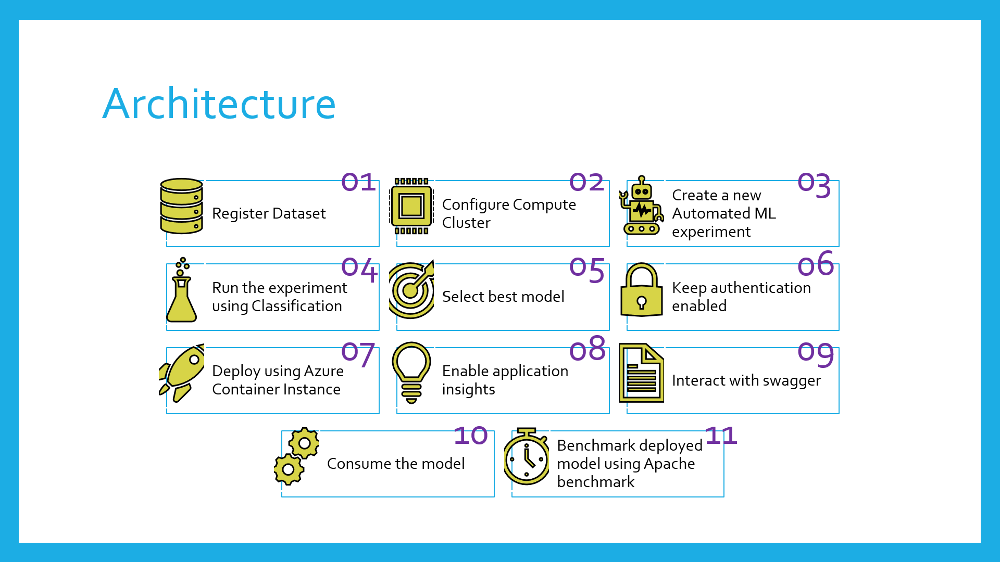

The architectural diagram is quite elaborative, however, a brief description of each step is as below:

Before begining with our experiment, we have to register the dataset (Step 01) and configure a compute cluster (Step 02) that will be used for training. Automated ML experiment is used to find the best classification model (Steps 03,04,05). The best model is then deployed as an HTTP REST endpoint using Azure Container Instances while keeping authentication enabled (Steps 06,07). We enable application insights for our deployed model using script ``logs.py`` (Step 08). To interact with the deployed model documentation, we use swagger (Step 09). Model is then consumed using ``endpoint.py`` (Step 10). An optional benchmarking is done for the deployed model using Apache benchmarking (Step 11), ``benchmark.sh`` is used here.

## Key Steps

Once we have registered the dataset, it appears in the Datasets tab of the Azure ML Studio

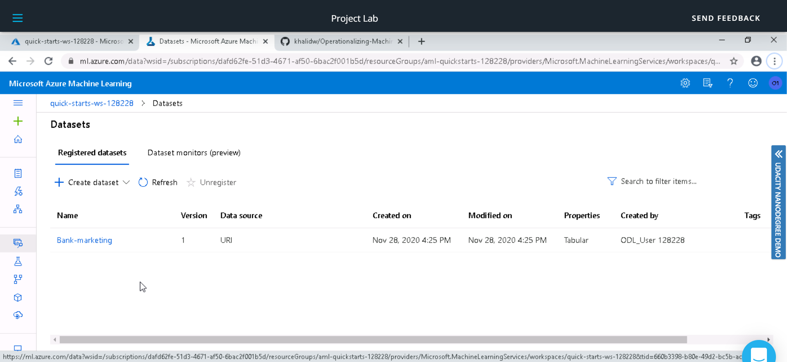

The Automated ML experiment took around 30 minutes to execute. Once completed, the status is changed from running to completed.

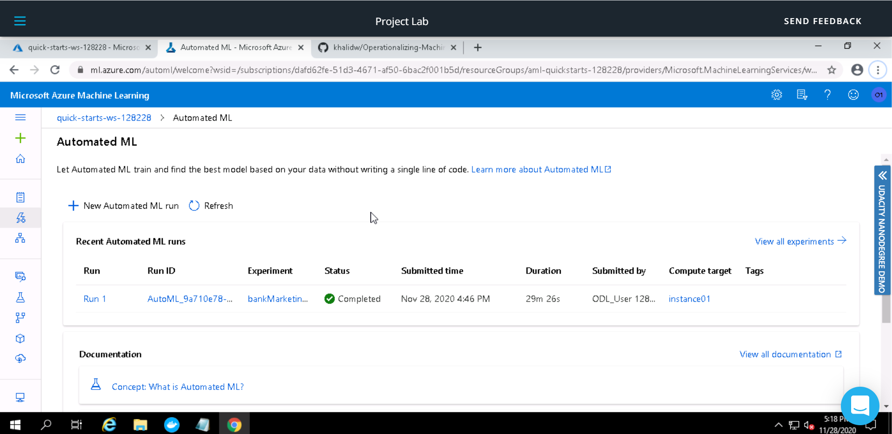

Voting Ensemble was found to be the best model with an accuracy of ``0.91654``. 

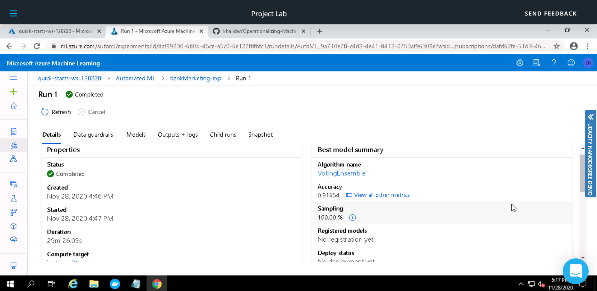

The image below shows few other metrics for the Best Model (Voting Ensemble)

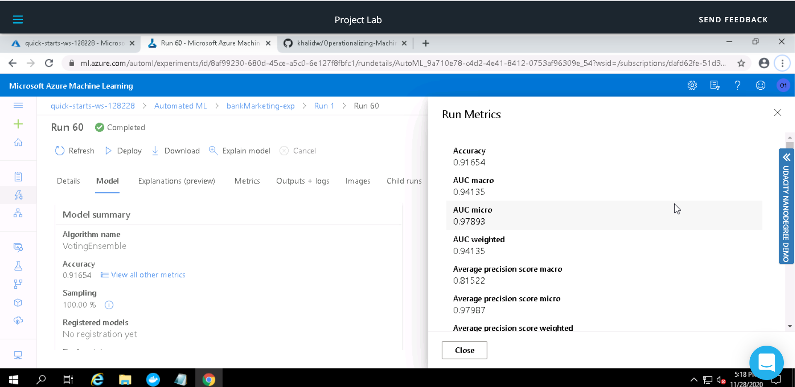

We did not enable application insights at model deployment, hence a status of ``False`` is shown

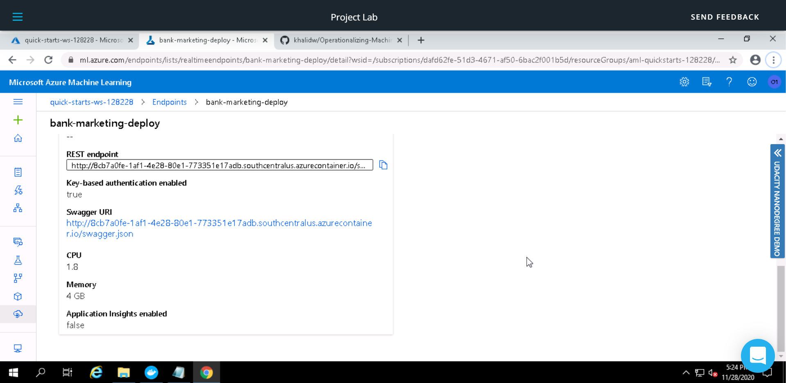

After we enable application insights using ``logs.py``, status is set to ``True`` and a URL is also displayed to access insights for the deployed model (Voting Ensemble)

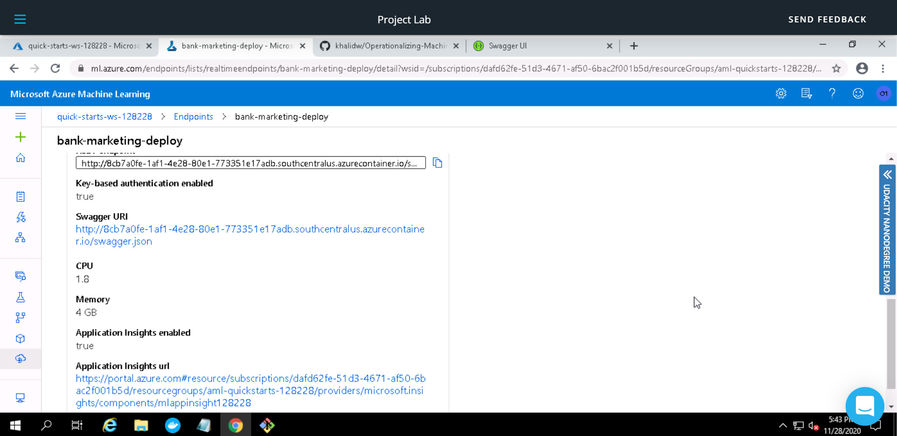

Screenshots below shows output of ``logs.py`` (Used in previous step to enable application insights)

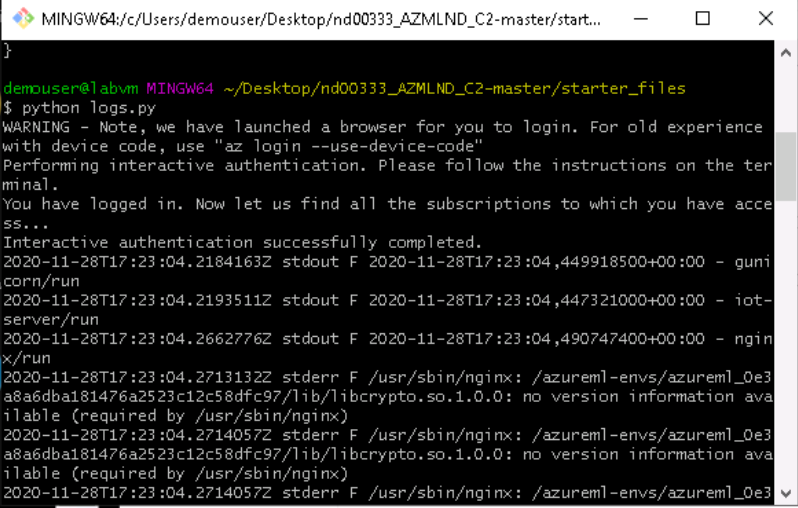

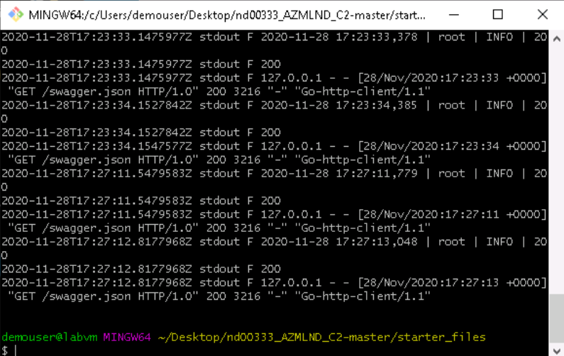

Swagger is used to interact with the HTTP REST API endpoint documentation. ``swagger.sh`` is used to run a swagger docker image, ``serve.py`` serves the ``swagger.json`` for our model on an HTTP server. Screenshots below describe the input data and expected output from the deployed model.  

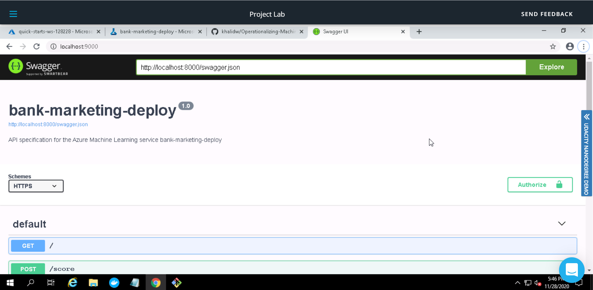

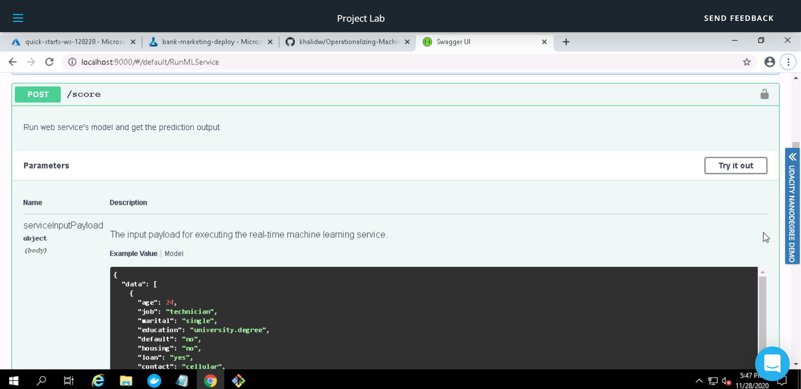

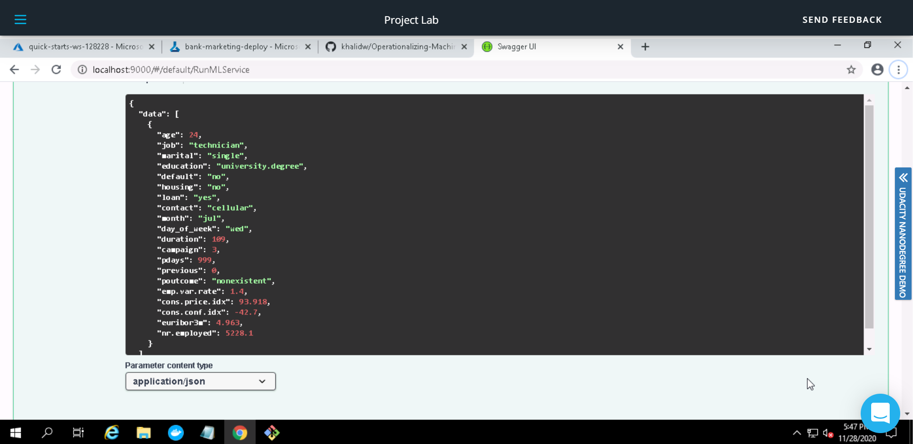

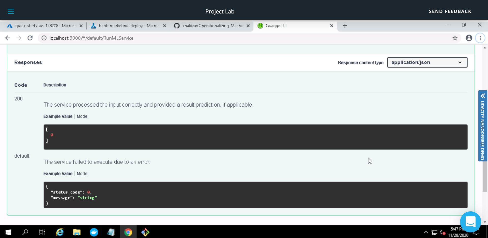

We use ``endpoint.py`` to consume the deployed model; A JSON document is passed on to the HTTP REST API endpoint of the deployed model using ``POST`` method, the model processes it and passes the results back as JSON document.

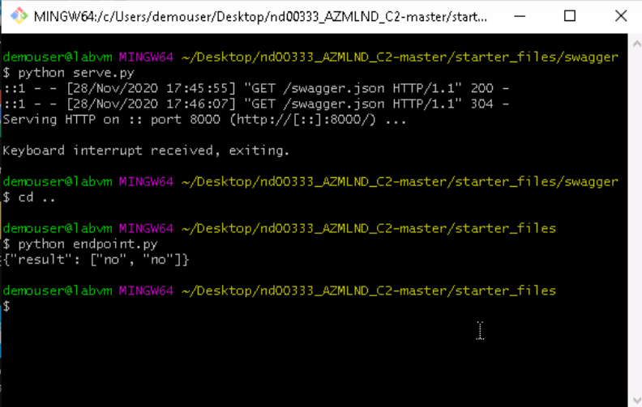

Apache Benchmarking is used to benchmark the deployed model (HTTP REST API endpoint). A number of requests are send to the deployed model and they are timed to find out metrics such as  failed requests, time per requests etc.

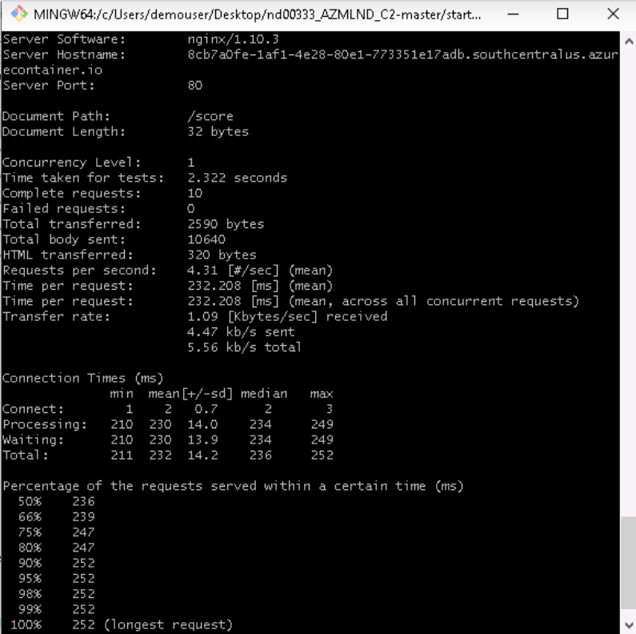

Now we try to create a pipeline for the entire process. Use Jupyter Notebook ``aml-pipelines-with-automated-machine-learning-step.ipynb`` to create this pipeline.

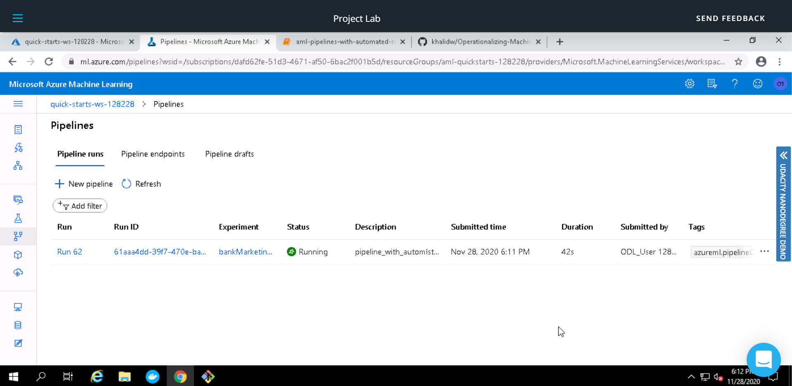

Pipeline Endpoint is created for consumption

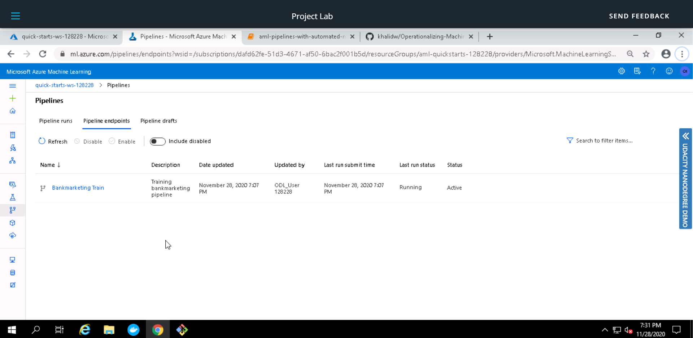

Pipeline Graph shows Bankmarketing dataset with AzureML module

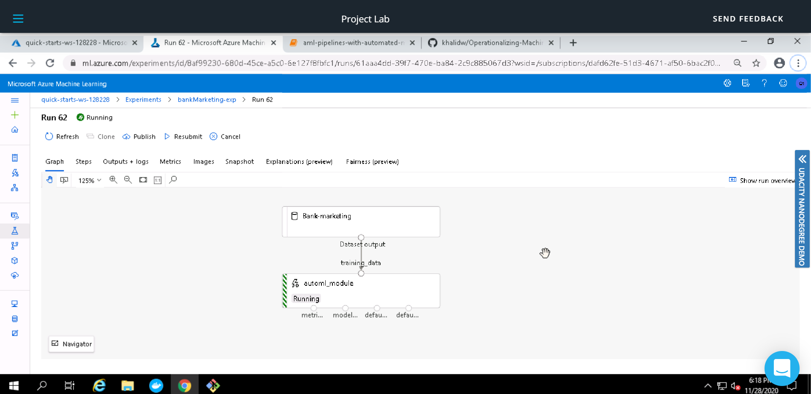

After the pipeline is published, we can use Published Pipeline Overview to see the status and REST endpoint of the pipeline.

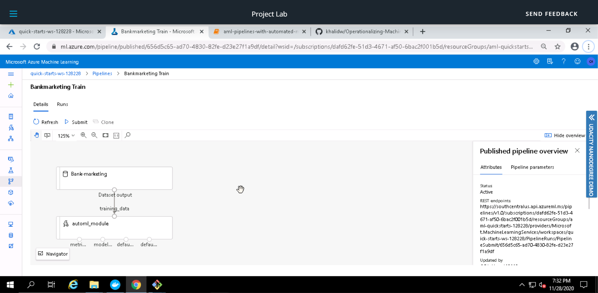

Run Details Widget in the Jupyter Notebook provides details such as run logs, duration, steps etc.

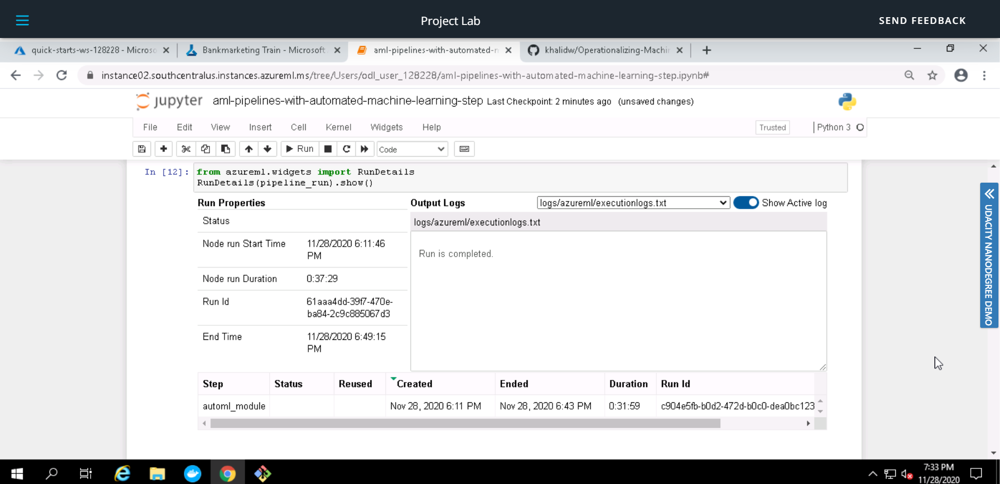

ML Studio Scheduled Run after completion.

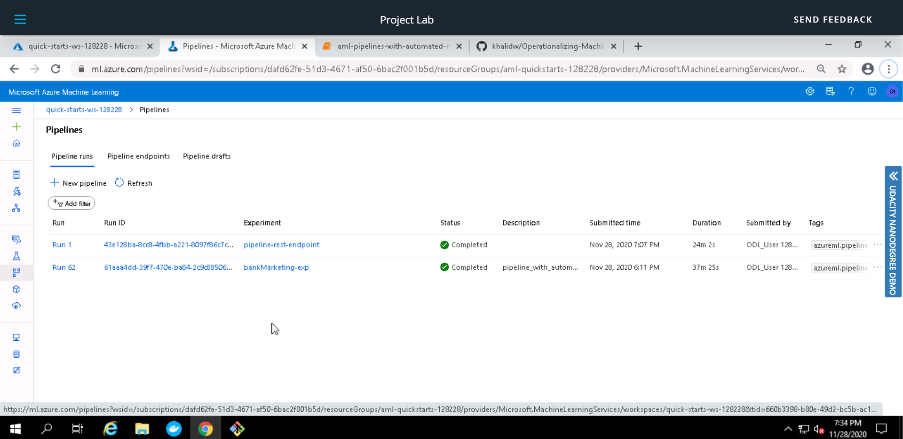

## Improvement Suggestions

The current accuracy is already very high ``0.91654``, however, for further improvement we can try following:

1. Use Deep Learning; This may provide a better performance, however we would need to increase the dataset size as well as the computer cluster for faster training.
1. Remove class imbalance in the exisiting data; The dataset used is highly imbalanced, hence our model maybe biased to one class.
1. Increase AutoML run duration; This would allow testing of a lot more models.  

## Screen Recording

You can view the screencast for this project demonstrating some aspects at this [link](https://youtu.be/F7GvbvJ7eaA)
