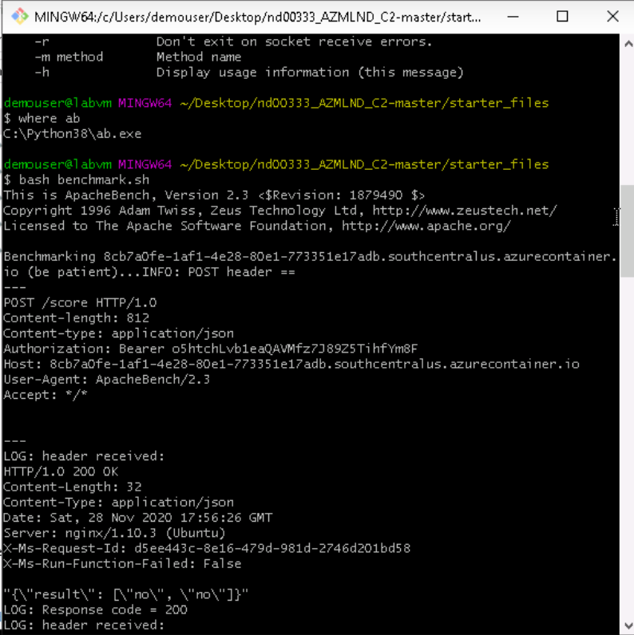

# Operationalizing Machine Learning

This is second of the three projects required for fulfillment of the Nanodegree Machine Learning Engineer with Microsoft Azure from Udacity. In this project, we create, publish and consume a Pipeline

The data used in this project is related with direct marketing campaigns (phone calls) of a Portuguese banking institution. The classification goal is to predict if the client will subscribe a term deposit (variable y). It consists of 20 input variables (columns) and 32,950 rows with 3,692 positive classes and 29,258 negative classes.

The data used in this project can be found [here:](https://automlsamplenotebookdata.blob.core.windows.net/automl-sample-notebook-data/bankmarketing_train.csv)

Detailed description of the dataset can be found [here:](https://archive.ics.uci.edu/ml/datasets/bank+marketing)

## Architectural Diagram

The diagram below shows the overall architecture of the project.

The architectural diagram is quite elaborative, however, a brief description of each step is as below:

Before begining with our experiment, we have to register the dataset (Step 01) and configure a compute cluster (Step 02) that will be used for training. Automated ML experiment is used to find the best classification model (Steps 03,04,05). The best model is then deployed using Azure Container Instances while keeping authentication enabled (Steps 06,07). We enable application insights for our deployed model using script ``logs.py`` (Step 08). To interact with the deployed model documentation, we use swagger (Step 09). Model is then consumed using ``endpoint.py`` (Step 10). An optional benchmarking is done for the deployed model using Apache benchmarking (Step 11), ``benchmark.sh`` is used here.

## Key Steps
*TODO*: Write a short discription of the key steps. Remeber to include all the screenshots required to demonstrate key steps.

1. Registered Dataset

1. Completed Experiment

1. Best Model

1. Best Model Metrics

1. Disabled Application Insights

1. Enabled Application Insights

1. Logs

1. Swagger

1. Model Consumption

1. Benchmarking

1. Pipeline

1. Pipeline Endpoint

1. Bankmarketing dataset with AzureML module

1. Published Pipeline Overview

1. Run Details Widget

1. ML Studio Scheduled Run

## Screen Recording
*TODO* Provide a link to a screen recording of the project in action. Remember that the screencast should demonstrate:

## Standout Suggestions
*TODO (Optional):* This is where you can provide information about any standout suggestions that you have attempted.
