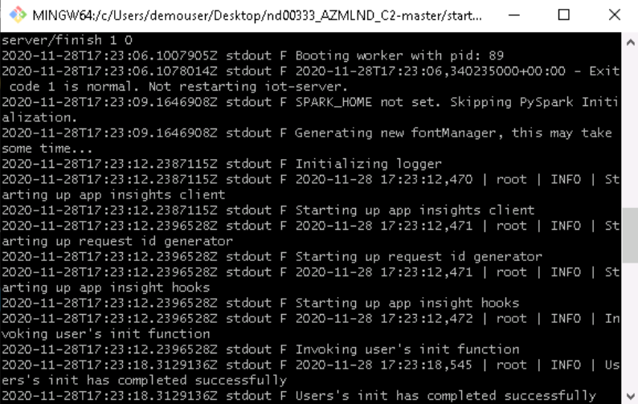

# Operationalizing Machine Learning

This is second of the three projects required for fulfillment of the Nanodegree Machine Learning Engineer with Microsoft Azure from Udacity. In this project, we create, publish and consume a Pipeline

The data used in this project is related with direct marketing campaigns (phone calls) of a Portuguese banking institution. The classification goal is to predict if the client will subscribe a term deposit (variable y). It consists of 20 input variables (columns) and 32,950 rows with 3,692 positive classes and 29,258 negative classes.

The data used in this project can be found [here:](https://automlsamplenotebookdata.blob.core.windows.net/automl-sample-notebook-data/bankmarketing_train.csv)

Detailed description of the dataset can be found [here:](https://archive.ics.uci.edu/ml/datasets/bank+marketing)

## Architectural Diagram

The diagram below shows the overall architecture of the project.

The architectural diagram is quite elaborative, however, a brief description of each step is as below:

Before begining with our experiment, we have to register the dataset (Step 01) and configure a compute cluster (Step 02) that will be used for training. Automated ML experiment is used to find the best classification model (Steps 03,04,05). The best model is then deployed using Azure Container Instances while keeping authentication enabled (Steps 06,07). We enable application insights for our deployed model using script ``logs.py`` (Step 08). To interact with the deployed model documentation, we use swagger (Step 09). Model is then consumed using ``endpoint.py`` (Step 10). An optional benchmarking is done for the deployed model using Apache benchmarking (Step 11), ``benchmark.sh`` is used here.

## Key Steps

Once we have registered the dataset, it appears in the Datasets tab of the Azure ML Studio

The Automated ML experiment took around 30 minutes to execute. Once completed, the status is changed from running to completed.

Voting Ensemble was found to be the best model with an accuracy of ``0.9164``. 

The image below shows the rest of metrices for the Best Model (Voting Ensemble)

We did not enable application insights at model deployment, hence a status of ``False`` is shown

After we enable application insights using ``logs.py``, status is set to ``True`` and a URL is also displayed to access insights for the deployed model (Voting Ensemble)

Screenshots below shows output of ``logs.py``

Swagger is used, 

We use ``endpoint.py`` to consume the deployed model; A JSON document is passed on to the HTTP REST API endpoint of the deployed model using ``POST`` method, the model processes it and passes the results back as JSON document.

Apache Benchmarking is used to benchmark the deployed model (HTTP REST API endpoint). A number of requests are send to the deployed model and they are timed to find out metrics such as  failed requests, time per requests etc.

1. Pipeline

1. Pipeline Endpoint

1. Bankmarketing dataset with AzureML module

1. Published Pipeline Overview

1. Run Details Widget

1. ML Studio Scheduled Run

## Screen Recording
*TODO* Provide a link to a screen recording of the project in action. Remember that the screencast should demonstrate:

## Standout Suggestions
*TODO (Optional):* This is where you can provide information about any standout suggestions that you have attempted.
